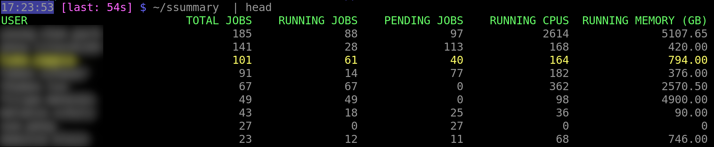

# ssummary

A shell script for summarising SLURM queues

- Shows users with current jobs in the queue
- Displays number of jobs (total, running, pending) and total memory and CPUs for running jobs
- The current user is highlighted so it's easy to find yourself in the list

